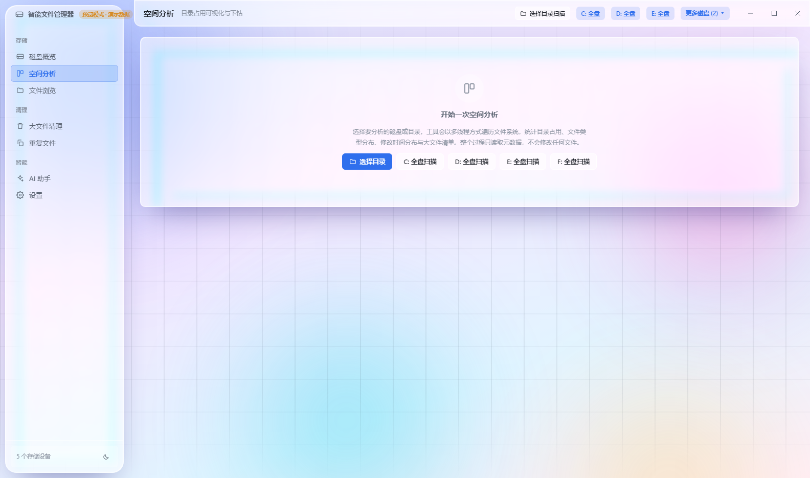
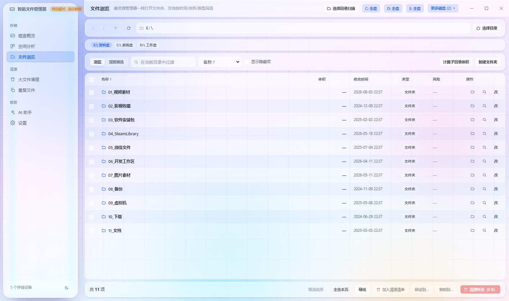
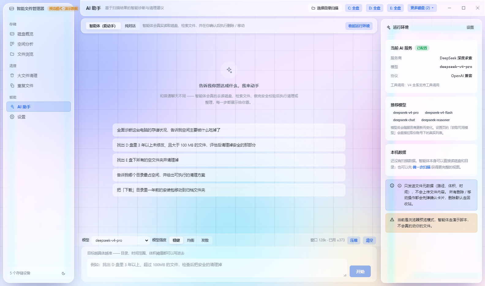
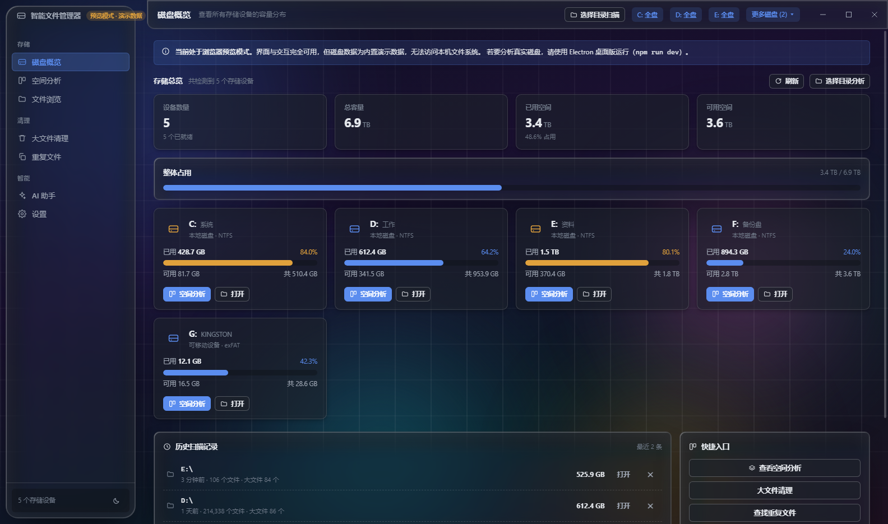
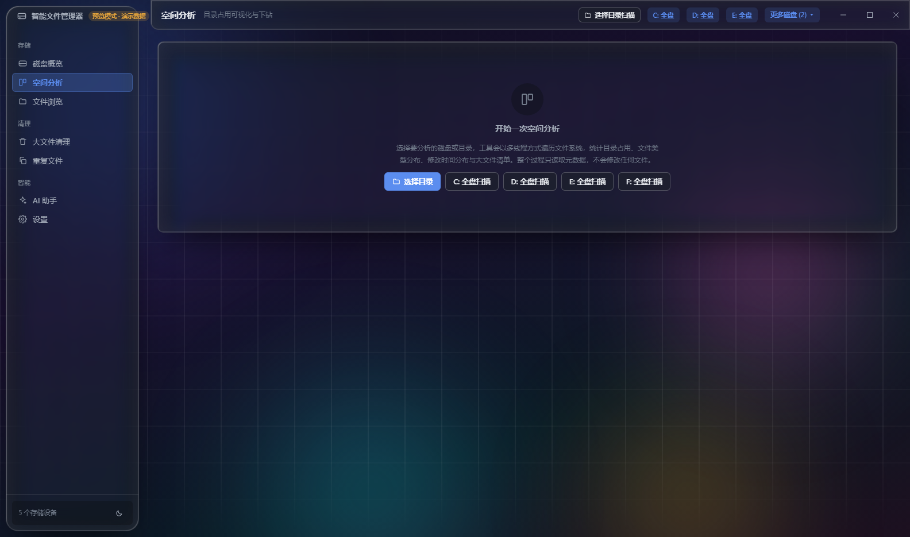

# 智能文件管理器 SmartFileManager

一个纯 TypeScript 实现的桌面端磁盘空间分析与清理工具：**全盘占用可视化 + 大文件安全清理 + 重复文件查重 + AI 智能诊断**。

硬盘越来越贵，但真正难的不是删文件，而是**知道该删什么、以及删得安全**。这个工具解决的就是这件事。

---

## 界面预览

> 以下截图开启了**液态玻璃**效果。浅色 / 深色主题各一套。
> 可用 `node scripts/capture-showcase.cjs` 重新生成（无头 Electron 截图，无需手动操作界面）。

**浅色主题**

| 磁盘概览 | 空间分析 |
| :---: | :---: |
|  |  |

| 文件浏览 | AI 智能体 |
| :---: | :---: |
|  |  |

**深色主题**

| 磁盘概览 | 空间分析 |
| :---: | :---: |
|  |  |

---

## 一、功能特性

### 1. 磁盘概览
- 自动枚举本机全部存储设备（本地磁盘 / 可移动设备 / 网络驱动器 / 光驱），读取真实容量与剩余空间
- 容量占用条按阈值变色（≥ 80% 橙色预警、≥ 90% 红色告警）
- 保存历史扫描记录，可随时重新打开旧结果

### 2. 空间分析（核心）
- **矩形树图（Squarified Treemap）**：面积严格对应占用体积，支持逐层点击下钻 + 面包屑导航，一眼看出「空间在哪一层被吃掉」
- **文件类型环形图**：视频 / 图片 / 文档 / 压缩包 / 代码 / 安装包 / 系统文件 / 其他
- **最后修改时间分布**：3 个月内 / 3–12 个月 / 1–3 年 / 3 年以上，快速识别「长期不动的历史包袱」
- **目录占用排行 + 扩展名占用排行**
- 顶层统计：总占用、文件数、目录数、大文件数、扫描耗时

### 3. 大文件清理
- 阈值筛选（≥ 50 MB / 100 MB / 500 MB / 1 GB / 5 GB）、类型筛选、关键词搜索、多字段排序
- 每行给出**风险提示**（安全 / 谨慎 / 危险）与判断理由（临时文件、安装包、下载目录长期未访问、系统关键位置等）
- 清理清单（购物车）：跨页面累积待清理项，实时汇总可释放空间
- 一键在系统文件管理器中定位文件

### 4. 文件浏览与批量操作
像资源管理器一样逐层打开文件夹，但比资源管理器多两件关键能力：

- **一键统计子目录体积** —— 资源管理器不显示文件夹大小，这里点一下就能算出当前目录下每个子文件夹的递归体积
- **深度筛选后批量处理**

| 维度 | 可选条件 |
| --- | --- |
| 修改时间 | 不限 / 近 7 天 / 近 30 天 / 近 3 个月 / 近 1 年 / 1 年以上未动 / **3 年以上未动** / 自定义日期区间 |
| 文件体积 | 不限 / > 10 MB / > 100 MB / > 1 GB / > 10 GB / < 10 MB / 自定义区间 |
| 文件类型 | 9 大分类多选 + 自定义扩展名（如 `iso,log`） |
| 其他 | 名称关键词、包含子目录（可指定递归深度）、结果包含目录、**只找空文件夹** |

选中后可执行：移入回收站 / 永久删除 / **移动到…** / **复制到…** / 重命名 / 新建文件夹 / 加入清理清单 / 导出 CSV·JSON。

移动与复制的实现细节：

- 同分区移动是**瞬时**的（只改写目录项）；跨分区自动降级为「复制 + 删除」
- 目标已存在同名项时可选择：自动重命名（`名称 (1)`）/ 跳过 / 覆盖
- 有目标合法性校验：不允许移动到受保护的系统位置，也不允许把目录移动到它自己内部
- 逐项统计成功 / 跳过 / 失败，失败原因可追溯

交互上支持勾选、Shift 范围选、Ctrl+A 全选、反选、Delete 键直接清理。

### 5. 重复文件查重
三级校验，兼顾速度与准确性：
1. 按文件体积分组（先排除绝大多数不可能重复的文件）
2. 对候选比对**前 64 KB 的 SHA-1 指纹**
3. 对仍然相同的文件做**全量内容哈希**确认

结果按「可释放空间」降序排列，默认每组保留修改时间最早的一份，支持单文件勾选 / 保留最早 / 全组选择。

### 6. AI 智能体（不是聊天机器人）

内置 **12 个真实工具**，模型不是"建议你去做"，而是**做完给你看**：

| 工具 | 作用 | 是否需确认 |
| --- | --- | --- |
| `list_drives` | 读取本机磁盘、卷标、容量、可用空间 | — |
| `get_scan_summary` | 读取最近一次扫描的摘要 | — |
| `list_directory` | 查看某个目录的直接子项 | — |
| `search_files` | 按时间 / 体积 / 类型 / 关键词递归检索真实文件 | — |
| `dir_sizes` | 递归统计若干目录的体积 | — |
| `file_info` | 查看一批文件的体积、时间、是否受保护 | — |
| `preview_cleanup` | **安全预演**：受保护路径校验 + 体积汇总，不删任何东西 | — |
| `execute_cleanup` | 真正删除（默认移入回收站） | ✅ |
| `move_files` / `copy_files` | 移动 / 复制到目标目录 | ✅ |
| `create_folder` | 新建文件夹 | ✅ |
| `reveal_in_explorer` | 在资源管理器中定位 | — |

工作方式（ReAct 循环）：

1. **侦察** —— 先读磁盘、列目录、按条件检索，所有结论都来自真实数据
2. **核对** —— 删除前必须走一遍 `preview_cleanup`，受保护的系统路径会被自动拦下
3. **执行** —— 危险操作弹出**确认卡片**：逐条列出真实文件路径与体积、合计大小、被拦截项，你点确认才动手
4. **收尾** —— 用 Markdown 说明做了什么、释放了多少、还剩什么问题

界面上每一步工具调用都是一张可展开的卡片（参数 + 完整返回结果 + 耗时），全程可审计。
删除默认走回收站；系统目录、程序目录、Windows 目录一律拦下。

**两种模式**：`智能体（能动手）` 会真实操作文件；`纯对话` 只做分析问答，不碰你的文件。

#### 模型支持

- 支持接入 **DeepSeek、阿里云通义千问、月之暗面 Kimi、智谱 GLM、火山方舟豆包、OpenAI、Anthropic Claude、Google Gemini、OpenRouter、硅基流动、Ollama 本地模型**，以及任意 OpenAI 兼容端点
- 统一抽象两套协议：OpenAI 兼容 `/chat/completions` 与 Anthropic `/messages`
- **模型列表可实时拉取**：设置页有「获取可用模型」按钮，直接请求服务商的 `/models` 接口，
  列出你账号下**当前真实可用**的模型 —— 不需要等软件更新，模型名永远不会过期
- 设置页可对任意服务商做**连通性测试**（实测时延 + 模型回显）
- 纯对话模式保留**一键全面诊断**：输出结构化的占用分析报告

> 智能体能力取决于所选模型是否支持工具调用（Function Calling）。主流模型均已支持；
> 侧栏会注明当前服务商的工具调用支持情况。

### 7. 设置
- AI 服务：Base URL / API Key / 模型 / 温度 / 最大 Token，可增删改、切换默认服务
- **获取可用模型**：直接请求服务商的 `/models` 接口，列出你账号下当前真实可用的模型
- 扫描策略：并发数（4–256）、目录树层级、隐藏文件、系统保留目录、`node_modules`、`.git`、自定义排除目录名与扩展名、大文件阈值
- 清理与安全：默认删除方式、永久删除二次确认
- 外观：浅色 / 深色 / 跟随系统、界面缩放，以及下方的液态玻璃效果

#### 液态玻璃效果（Liquid Glass）

外观设置里可以开启。它不是普通的背景模糊，而是**真实折射**：

1. 用 Canvas 生成「圆角矩形 SDF → R/G 通道法线」的位移贴图
2. 贴图喂给 SVG `feDisplacementMap`，在玻璃边缘产生真实位移
3. 位移两次（第二次放大 R 通道）→ 产生类似真实玻璃边缘的**色差彩边**
4. 整个滤镜通过 `backdrop-filter: url(#…) blur() saturate()` 应用

配合界面背后一层缓慢漂移的彩色光斑（折射需要身后有可辨认的细节才看得出来）、
玻璃边缘的镜面高光、以及鼠标跟随的反射光斑，得到 iOS/macOS 那种「液态玻璃」观感。
浅色与深色主题各有一套配色。

**性能取舍**（这些是刻意的，别改回去）：

- 折射**只加在「面积大、位置稳定」的表面上**：侧栏、顶栏、右侧信息栏、弹窗、卡片，上限 18 个
- **文件列表这类密集滚动区域绝不加** —— `backdrop-filter` 会让滚动直接卡死
- 位移贴图按尺寸缓存：大量卡片尺寸相同，只生成一张
- 元素尺寸与强度都没变就跳过重建，所以切换页面的增量开销很小
- 贴图按 0.5 倍分辨率生成：SDF 本身平滑，降采样只会更柔，不会走形

设置里可以调**折射强度**（0–120px，0 = 只做磨砂）和**背景光斑是否漂移**。
关掉开关时，注入的 DOM、SVG 滤镜、内联样式会全部撤干净，回到普通主题。

> 这个效果持续占用 GPU，默认关闭。如果开启后切换页面或滚动变得不流畅，
> 先把折射强度调低或关掉背景漂移。

---

## 二、技术栈

| 层次 | 选型 |
| --- | --- |
| 运行框架 | Electron 31 |
| 界面 | React 18 + TypeScript 5.6 |
| 状态管理 | Zustand |
| 构建 | electron-vite + Vite 5 |
| 样式 | 原生 CSS + CSS 变量主题（无 UI 框架依赖） |
| 图表 | 全部自研 SVG（矩形树图 / 环形图 / 排行条），零图表库依赖 |
| Markdown | 自研轻量渲染器（不使用 `dangerouslySetInnerHTML`） |
| 打包 | electron-builder |

**没有引入任何第三方图表库、UI 组件库或 Markdown 库** —— 全部可视化与文本渲染都是自己实现的，产物小、可控、无供应链风险。

---

## 三、目录结构

```
src/
├── shared/                    # 主进程与渲染进程共享的唯一契约层
│   ├── types.ts               # 全部数据结构与 IPC 通道常量
│   ├── api.ts                 # SfmApi 能力接口（渲染层唯一依赖）
│   ├── filetypes.ts           # 扩展名 → 文件分类映射表
│   ├── format.ts              # 字节 / 时间 / 速率格式化
│   └── digest.ts              # 扫描结果 → LLM 上下文摘要
│
├── main/                      # 主进程（Node 侧，负责一切重活）
│   ├── index.ts               # 应用启动、窗口、安全导航策略
│   ├── ipc.ts                 # IPC 编排（扫描 / 查重 / AI / 删除）
│   ├── core/
│   │   ├── drives.ts          # 驱动器枚举（WMI + fs.statfs）
│   │   ├── scanner.ts         # 高性能扫描引擎
│   │   ├── duplicates.ts      # 三级重复文件检测
│   │   ├── cleanup.ts         # 删除执行与释放空间统计
│   │   ├── safety.ts          # 删除安全策略（受保护路径）
│   │   ├── store.ts           # 设置持久化 + safeStorage 加密
│   │   └── minheap.ts         # 定长最小堆（Top-N 大文件）
│   └── ai/
│       ├── client.ts          # 双协议流式客户端 + 连通性测试
│       └── prompts.ts         # 提示词模板
│
├── preload/index.ts           # contextBridge 暴露 window.sfm
│
└── renderer/src/
    ├── App.tsx                # 应用外壳（标题栏 / 侧边栏 / 顶栏）
    ├── bridge/                # 能力桥：Electron 环境 或 浏览器演示桥
    ├── store/useAppStore.ts   # 全局状态与编排
    ├── components/            # 可视化组件、UI 原子、弹窗
    ├── pages/                 # 六大页面
    ├── styles/                # 主题 / 布局 / 组件样式
    └── utils/                 # 风险评级、配色
```

---

## 四、快速开始

### 直接使用（双击即用）

打包好的程序在 `release/` 目录，**不需要安装 Node.js，也不需要任何运行时**：

| 文件 | 推荐度 | 说明 |
| --- | --- | --- |
| `智能文件管理器-1.0.0-绿色版.zip` | ⭐ **首选** | 解压一次到任意位置，之后双击里面的 `SmartFileManager.exe`。**启动约 1 秒**，不写注册表，可整体拷到 U 盘 |
| `智能文件管理器-1.0.0-安装版.exe` | ⭐ 推荐 | 常规安装程序，可选安装目录，自动创建桌面与开始菜单快捷方式。**启动约 1 秒** |
| `智能文件管理器-1.0.0-免安装版.exe` | 备用 | 单个 exe，双击就能跑，适合临时使用。启动约 3 秒（已启用 ZIP 载荷，比原先的 LZMA 快得多），代价是体积从 69 MB 涨到 107 MB |

（详细对比和实测方法见下面「启动速度」一节。）

应用已内嵌多尺寸图标与版本信息，在资源管理器里显示为正常的 Windows 程序，而不是默认的 Electron 图标。

#### 启动速度（本机实测，`scripts/measure-startup.cjs` 可复现）

把启动过程拆开看，结论很清楚 —— **应用本身不慢，慢的是 Windows 加载这个 180 MB 的 exe**：

| 阶段 | 首次运行 | 之后每次 |
| --- | --- | --- |
| 双击 → 进程开始执行 JS<br>（Windows 加载 exe + 杀毒扫描，**在应用之外**） | **3.90 s** | **0.36 s** |
| JS → 窗口创建 | 0.15 s | 0.20 s |
| 窗口 → 渲染层首帧完成 | 1.01 s | 0.48 s |
| **合计** | **5.17 s** | **1.15 s** |

**对照：裸 Electron（不含任何业务代码）在本机启动也要 1.00 s** —— 也就是说这个一万四千行应用
的启动开销几乎是零，剩下的全是 Electron 运行时的固有成本。

那 3.9 秒的首次开销是杀毒软件在扫描一个 180 MB 的未签名 exe，代码层面无解
（想彻底消除，可以把这个 exe 加进杀毒软件的信任列表）。

三种形态的实测对比：

| 形态 | 冷启动 | 之后每次 | 体积 |
| --- | --- | --- | --- |
| 绿色版（解压后直接跑 exe） | 5.17 s | **1.15 s** | 110 MB（解压后 265 MB） |
| 安装版 | 5.17 s | **1.15 s** | 76 MB |
| 免安装版 | 8.97 s | **3.26 s** | 107 MB |

**免安装版为什么更慢？** 它每次启动都要把 265 MB 运行时解压到临时目录，
而解压出来的是「全新文件」，于是**每次都重新触发一遍杀毒扫描**。

> 这里做过一次优化：把便携版的载荷从 LZMA 换成 ZIP（`portable.useZip: true`），
> 解压速度大幅提升（热启动从约 9–10 s 降到 3.26 s），代价是单文件体积从 69 MB 涨到 107 MB。
> 对"启动要快"这个诉求来说，这个交换是划算的。

代码侧也做了这些优化，别改回去：

- **启动骨架屏**：外壳（侧栏 + 顶栏 + 加载提示）写在 `index.html` 里，是纯静态 HTML/CSS，
  浏览器解析完就上屏 —— 双击后几乎立刻看到"程序起来了"，React 挂载后再淡出
- 七个页面**按需加载**，首包从 500 KB+ 降到 ~200 KB，首屏只解析当前页面的代码
- 窗口**立即显示**，不等渲染层首帧
- **驱动器枚举带 30 秒缓存** —— 它要起一个 PowerShell 进程（中文 Windows 上 0.5–2 s），
  启动时「磁盘概览」和「文件浏览」会各要一次，不缓存就白白多花一倍
- 扫描历史等非关键数据在首屏渲染之后再后台加载

### 从源码运行（开发用）

需要 Node.js ≥ 18（推荐 20 / 22），支持 Windows 10+ / macOS 11+ / Linux（深度适配 Windows）。

### 安装

```bash
npm install
```

若官方 npm 源访问缓慢，项目已在 `.npmrc` 中预置国内镜像（registry + Electron 二进制镜像）：

```ini
registry=https://registry.npmmirror.com
electron_mirror=https://npmmirror.com/mirrors/electron/
```

### 开发运行

```bash
npm run dev
```

### 构建

```bash
npm run build        # 构建 Electron 三端产物 → out/
npm run build:web    # 构建浏览器预览版 → out/web/
npm run typecheck    # 类型检查（主进程 + 渲染进程）
npm run icon         # 生成应用图标 → build/icon.ico
npm run dist         # 一键打包 Windows 免安装版 + 安装版 → release/
```

### 打包说明（Windows 上的一个坑）

`npm run dist` 走的是 `scripts/package.mjs`，它分五步而不是直接调 electron-builder：

1. `electron-builder --dir` 生成未打包的应用目录
2. 把目录从 `win-unpacked` 改名为 `SmartFileManager`（绿色版 zip 的顶层目录）
3. 手动调用 `rcedit` 写入图标与版本信息
4. `electron-builder --prepackaged` 复用该目录，产出免安装版与安装版
5. 用 `7za` 把该目录打成绿色版 zip

> **中转目录会累积**：出于「绝不递归删除目录」的考虑（见下），脚本遇到已存在的 `stage/*` 就换一个新的
> `stage/run-<时间戳>/`，每份约 265 MB —— 攒十几次就是 3 GB 以上。
> 打包收尾时**会自动保留最近 2 次、清掉更早的**；想手动清或先看看会删什么：
>
> ```bash
> npm run clean:stage -- --dry      # 只列出，不真删
> npm run clean:stage               # 保留最近 2 次
> npm run clean:stage -- --keep 1   # 只保留最近 1 次
> ```
>
> 注意区分：`npm run clean:stage` 只清中转目录、**保留 release/ 里的产物**；
> 而 `npm run clean` 会把 `stage/`、`release/`、`out/` 一起删掉（连交付产物）。
>
> Windows 上有个小坑：`app.asar` 这类被内存映射的文件无法删除（unlink 报 EBUSY），
> 清理脚本会退化成「截断为 0 字节」把空间先释放掉，目录里留个空壳，重启后重跑即可删净。
>
> 另外：`npm run measure` 可以复现上面的启动耗时测量（可追加 exe 路径参数）。
>
> **免安装版的启动画面**（自解压时显示的那张图）由 `scripts/make-splash.cjs` 生成。
> 它是用离屏 Electron 窗口渲染 HTML/CSS 再截成 24 位 BMP 的 —— 因为 `portable.splashImage`
> 只接受 BMP，而 BMP 画不了文字，纯手写像素会很难看。改样式就直接改那个脚本里的 HTML 字符串。

**为什么不直接跑 electron-builder？** 它默认会下载 `winCodeSign` 包并调用 rcedit 编辑 exe 资源，
而 `winCodeSign-2.6.0.7z` 里含 macOS 的符号链接，在未开启「开发者模式」或非管理员权限的 Windows 上
解压会直接失败（`ERROR: Cannot create symbolic link : 客户端没有所需的特权`），整个打包随之中断。
绕开它的办法就是上面这三步 —— 这也是 `package.json` 里 `win.signAndEditExecutable` 设为 `false` 的原因。

另外脚本还会自动处理三件事：

- 设置 `ELECTRON_BUILDER_BINARIES_MIRROR` 走国内镜像
- 从子进程环境中移除 `ELECTRON_RUN_AS_NODE`（否则 Electron 会退化成纯 Node 而启动失败）
- **不做任何递归删除**：部分环境的「安全删除」策略会把递归删除调用挂住。因此脚本遇到已存在的中转目录时，
  直接换用 `stage/run-<时间戳>/`，而不是删除旧的。历史目录可以在确认不再需要后手动删除，
  也可以直接用 `npm run dist` 之外的方式清理。

### 浏览器预览版（无需安装依赖即可看界面）

```bash
npm run build:web
# 然后直接用浏览器打开 out/web/index.html
```

预览版会自动降级到内置演示数据桥（`src/renderer/src/bridge/demoBridge.ts`），界面与交互完全可用，但无法访问本机文件系统。

---

## 五、扫描引擎原理

这是整个工具的性能关键。对一块装满文件的 4 TB 硬盘，朴素实现会跑到天荒地老。

### 并发模型
- 目录遍历采用**工作窃取式的双池模型**：目录级 worker 池（并发 = 并发数 / 2，上限 32）+ 文件级 `stat` 批量池（分块大小 = 并发数，8–256 可调）
- 机械硬盘建议 16–32，固态硬盘建议 64–128

### 内存策略
扫描一块 1 TB / 百万文件的硬盘时，**不会把所有文件对象驻留内存**：
- 目录体积用 `Map<路径, 自身体积>` 增量聚合，最后一次性构建目录树
- 目录树构建采用**后序累加 + 记忆化**，整体复杂度 O(节点数)
- Top-N 大文件使用**定长最小堆**，O(n log k)
- 命中阈值的大文件列表有 20000 条硬上限，超出后按体积裁剪

### 健壮性
- 不跟随符号链接与 Windows 目录联接，避免循环引用与重复计数
- 权限不足 / 文件被占用的目录被记录并跳过（最多保留 40 条样本），不会中断整个扫描
- 进度事件按 220 ms 节流推送，避免高频 IPC 拖垮界面
- 支持随时取消（`AbortController` 贯穿整个遍历过程）

---

## 六、安全机制

清理功能天然危险，因此做了四层防护：

1. **默认走系统回收站**（`shell.trashItem`），可随时恢复
2. **受保护路径校验**（`src/main/core/safety.ts`）—— 无论前端怎么传，主进程一律拒绝：
   - 磁盘根目录（`C:\`）
   - `Windows` / `System32` / `WinSxS` / `Program Files` / `ProgramData` / `Boot` / `EFI` / `Recovery` / `$Recycle.Bin` / `System Volume Information` 等系统关键位置
   - `pagefile.sys` / `hiberfil.sys` / `bootmgr` / `ntldr` 等系统关键文件
   - 用户主目录本身、以及盘符下一级目录（层级过浅）
3. **父子路径去重**：同时选中 `D:\a` 与 `D:\a\b.txt` 时只处理父级，避免重复删除
4. **永久删除额外确认**：需手动勾选风险确认框才能执行不可恢复操作

前端也做了一次同规则预检（`src/renderer/src/utils/protect.ts`），把风险条目提前标出来 —— 但**真正的拦截始终在主进程**，前端只是提示。

---

## 七、隐私说明

- 应用**完全离线运行**，没有任何自建后端，唯一的网络请求是你选择的大模型服务商
- 送给大模型的只有**文件元数据**：路径、体积、修改时间、类型统计、目录排行。**绝不读取或上传文件内容**
- 摘要体积可实时查看（设置页显示 token 估算），超过 24000 字符会自动截断
- API Key 使用 Electron `safeStorage`（Windows 走 DPAPI）加密落盘；系统不支持加密时会给出明确风险提示
- 密钥只回传掩码给界面，渲染进程拿不到明文

---

## 八、已知限制

- 扫描只统计**逻辑体积**，不处理硬链接（同一份数据被硬链接到多个路径时会重复计入）
- 「跳过隐藏文件」在 Windows 上是**按名称近似判断**（以 `.` 开头），因为 Node 的 `readdir` 不暴露 Windows 隐藏属性；`skipSystem` 覆盖回收站、卷影副本等真正的隐藏系统目录
- 浏览器预览版为演示数据，无法访问本机文件系统
- 单次同步渲染文件列表上限 1500 行（超出请用搜索缩小范围），确保界面不卡顿

---

## 九、常见问题

**Q：扫描一块 1 TB 硬盘要多久？**
固态硬盘通常 1–3 分钟，机械硬盘 5–15 分钟，取决于文件数量。文件数量是主因，不是数据量。

**Q：删了文件为什么磁盘空间没变？**
默认是移入回收站，文件在清空回收站前仍占用空间。确认无误后请到系统回收站执行清空。

**Q：AI 分析显示「未配置 API Key」？**
前往「设置 → AI 服务」选择服务商，填入对应平台的 Key 后点「设为默认服务」。Ollama 本地模型无需 Key。

**Q：模型不支持 JSON 输出怎么办？**
「生成可执行清理清单」依赖结构化输出。若你的模型不支持 `response_format`，可改用「一键全面诊断」，它会返回 Markdown 报告，你可以据此手动勾选文件。

**Q：启动时白屏或崩溃（虚拟机 / 远程桌面 / 老旧显卡驱动）？**
设置环境变量 `SFM_DISABLE_GPU=1` 强制软件渲染：

```bash
# Windows PowerShell
$env:SFM_DISABLE_GPU=1; npm run dev
```

---

## 十、许可证

MIT —— 完整条款见 [LICENSE](LICENSE)。

这意味着你可以自由使用、修改、分发本项目（包括闭源商用），只需在副本中保留版权声明与许可证原文。

> 注意：许可证**不覆盖项目名称**。「智能文件管理器 / SmartFileManager」这个名称不随 MIT 授权，
> 基于本项目二次开发时请另取名字，避免混淆。

**第三方组件**：本项目打包 Electron（含 Chromium、Node.js）。它们各自的许可证文件随安装目录一并分发，
详见安装目录下的 `LICENSES.chromium.html` 等文件。运行时依赖（React / ReactDOM / Zustand）均为 MIT。
